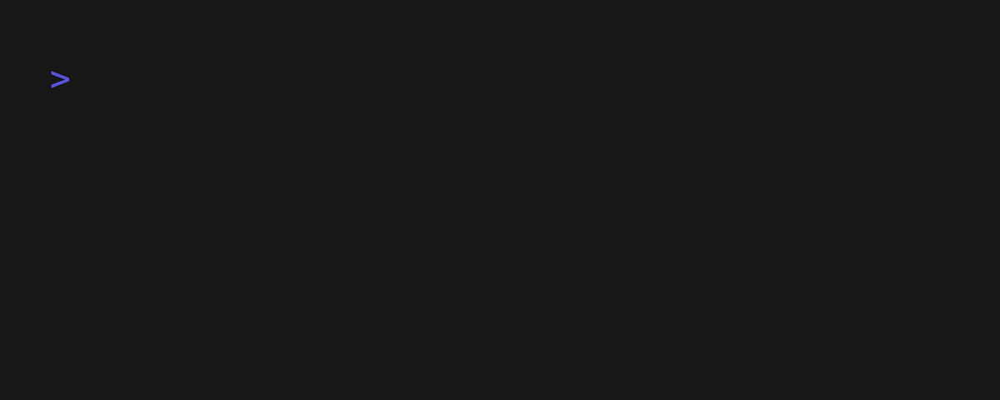
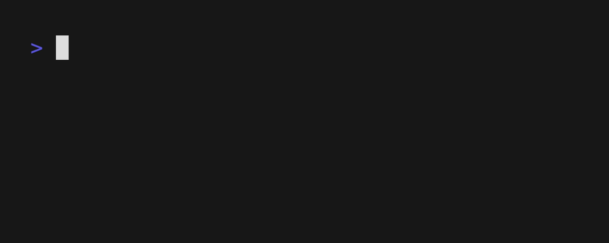

# td

### philosophy

- fully interactive
- confluence of suckless and cute
- follow the xdg base directory specification

### usage

```shell
td
```

#### add tasks

- press `a` (add) or `i` (insert) to open the prompt
- press `<enter>` to confirm and add the new task
- press `<esc>` to cancel and close the prompt


#### edit a task

- press `e` to open the prompt
- press `<enter>` to confirm and edit the task
- press `<esc>` to cancel and close the prompt


#### move a task

- press `<shift>` + `<up>` to move up
- press `<shift>` + `<down>` to move down


#### toggle state

- press `<enter>` or `<space>`


#### delete tasks

- press `<backspace>`, `d` (delete), `r` (remove) or `x` to death mark the task
- to remove the mark, press any of those keys again



#### clean the list

- press `c` (clean), it removes done and marked tasks



#### exit

- press `<esc>`, `<ctrl>` + `c` or `q` (quit) to close td
- any pending tasks will be kept saved

### maybe in time

- [ ] organize tasks by context
- [ ] non-interactive features using flags
- [ ] add tasks by stdin
- [ ] day planning (select specific tasks from previous backlog)
- [ ] keep history of tasks done
- [ ] package and installation guides
  - [ ] homebrew tap
  - [ ] nix
  - [ ] flatpack (or similar)
  - ... any other

pull requests are welcome ;)
